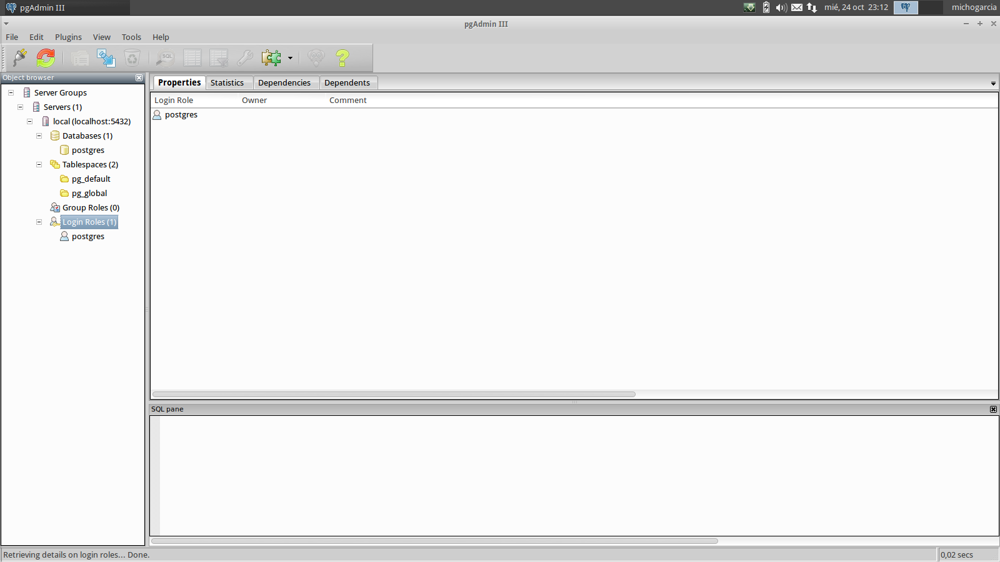
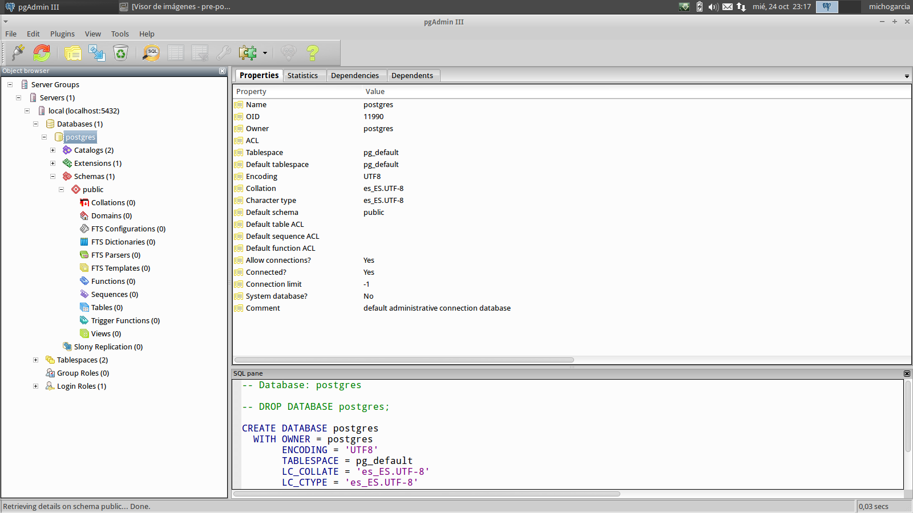
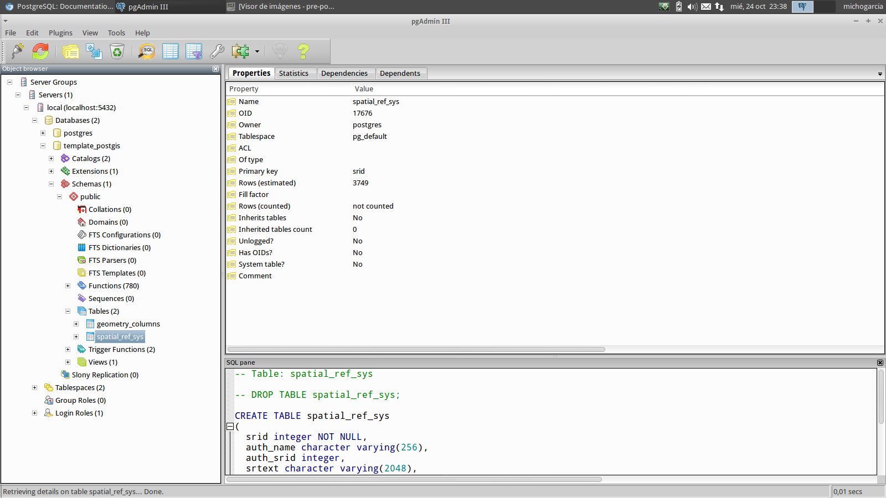
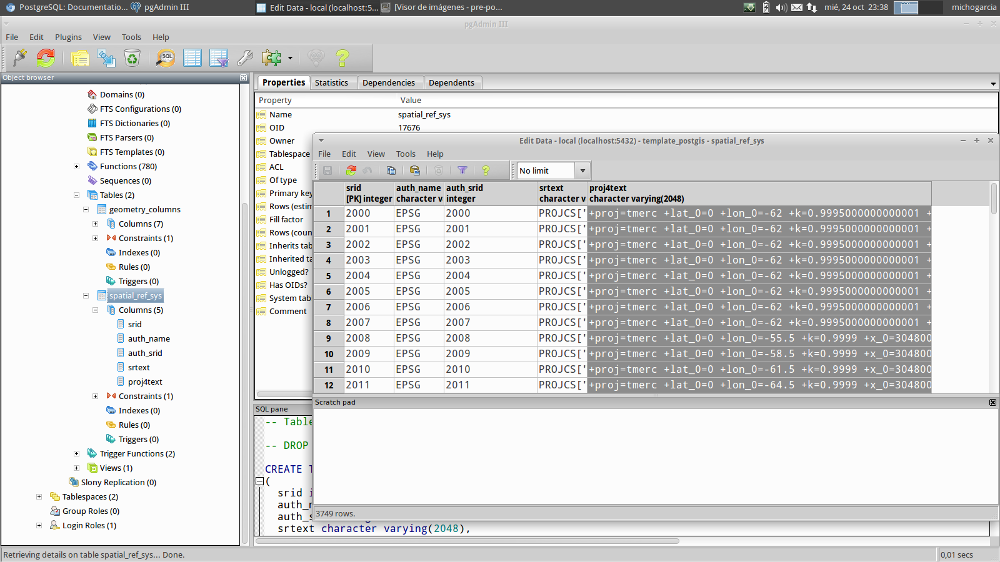
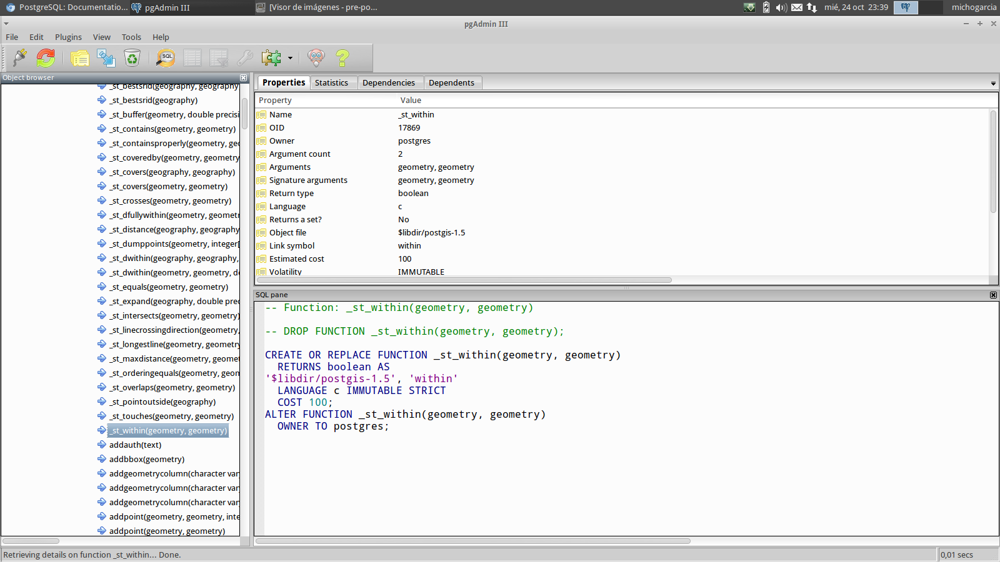
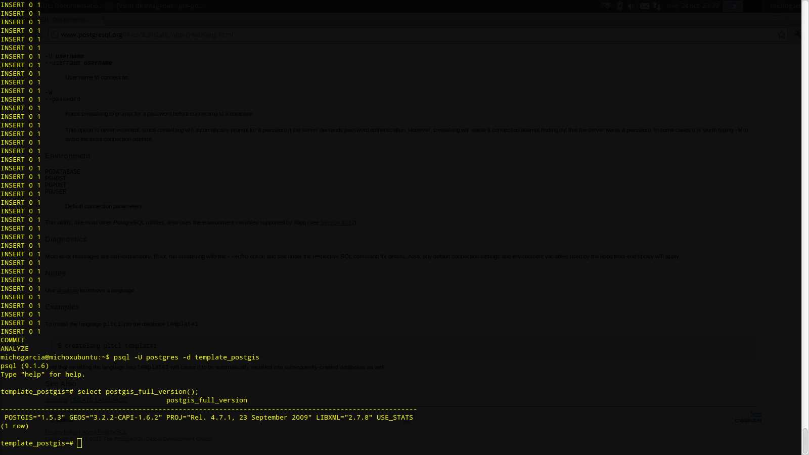

.. |PG|  replace:: *PostGIS*
.. |PSQL| replace:: *PostgreSQL*

********************************
|PG|, características espaciales
********************************
Introducción
============
Para el curso que nos compete realizaremos las prácticas con la versión 2.0 de |PG| por ser la que dispone del módulo de Raster y de Topología. Para la instalación de este es necesario un conocimiento de conceptos de instalación y de compilación de librerías que exceden el objetivo de este curso. Se explicará la instalación de una versión anterior de |PG|, exactamente la 1.5 que es la que se encuentra disponible desde los repositorios con la que el alumno puede realizar la mayor parte de los ejercicios de este curso. Para una instalación de la versión |PG| 2.0 se remite al alumno al capítulo de referencias donde podrá encontrar abundante información.

|PG| es una extensión espacial para |PSQL| que permite gestionar objetos geográficos, de tal manera que añade esta capacidad al SGBD |PSQL|. 
 
Instalación y configuración de |PG|
===================================
Como ya se ha comentado la instalación de |PG| en su versión 1.5 la realizaremos desde los repositorios de nuestro sistema operativo.

Una vez que hayamos instalado PostgreSQL en nuestro equipo podremos instalar |PG| mediante::

	$ sudo apt-get install postgresql-9.1-postgis postgis
	
De esta manera estaremos instalando los objetos, funciones y scripts necesarios para poder utilizar las componentes geográficas de nuestro SGBD |PSQL|. 

Espacialización de una base de datos
------------------------------------
Módulo principal y vectorial
^^^^^^^^^^^^^^^^^^^^^^^^^^^^

La integración de |PG| con |PSQL| está hecha en el lenguaje PL/PGSQL, por
lo que para dotar de capacidades espaciales una base de datos existente es necesario
primero añadir soporte para este lenguaje. Esto es necesario para versiones de |PSQL| anteriores a la 9.1::

	$ createlang plpgsql curso




	   
A continuación hay que localizar dos ficheros SQL de PostGIS que al ejecutarse
añadiran las estructuras necesarias a nuestra base de datos. Estos ficheros
se llaman *lwpostgis.sql* (o símplemente *postgis.sql*) y *spatial_ref_sys.sql*.

Para localizarlos podemos utilizar el comando *locate*::

	$ locate postgis.sql
	/usr/share/postgresql/8.4/contrib/postgis-1.5/postgis.sql
	/usr/share/postgresql/8.4/contrib/postgis-1.5/uninstall_postgis.sql
	/usr/share/postgresql/9.1/contrib/postgis-1.5/postgis.sql
	/usr/share/postgresql/9.1/contrib/postgis-1.5/uninstall_postgis.sql
	
	$ locate spatial_ref_sys.sql
	/usr/share/postgresql/8.4/contrib/postgis-1.5/spatial_ref_sys.sql
	/usr/share/postgresql/9.1/contrib/postgis-1.5/spatial_ref_sys.sql

Una vez localizados dos ficheros de la misma versión, es necesario ejecutarlos
en el servidor. Existen dos formas de hacerlo con *psql*: el parámetro -f y
el comando \\i. Con el parámetro -f llamaríamos a *psql* desde la línea de
comandos del sistema y especificaríamos el fichero .sql que queremos ejecutar
con dicho parámetro. Para que el fichero se ejecute en la base de datos que
nos interesa hay que especificar también el parámetro -d visto anteriormente::

	$ psql -U postgres -d template_postgis -f /usr/share/postgresql/9.1/contrib/postgis-1.5/postgis.sql
	$ psql -U postgres -d template_postgis -f /usr/share/postgresql/9.1/contrib/postgis-1.5/spatial_ref_sys.sql

La opción de usar el comando \\i consiste en entrar al modo interactivo de *psql*
conectando a la base de datos de interés y ejecutando el fichero con \\i::

	$ psql -U postgres -d template_postgis
	=# \i /usr/share/postgresql/9.1/contrib/postgis-1.5/postgis.sql
	=# \i /usr/share/postgresql/9.1/contrib/postgis-1.5/spatial_ref_sys.sql
	
o también se puede entrar a la base de datos por defecto (*postgres*) y
conectar interactivamente a nuestra base de datos luego con \\c::

	$ psql -U postgres
	=# \c template_postgis
	=# \i /usr/share/postgresql/9.1/contrib/postgis-1.5/postgis.sql
	=# \i /usr/share/postgresql/9.1/contrib/postgis-1.5/spatial_ref_sys.sql
	
Tras esta operación se puede observar que han aparecido dos 
nuevas tablas: *geometry_columns* y *spatial_ref_sys*, además de
numerosas funciones en el esquema *public*.


	   

	   



	   	   
La tabla *geometry_columns* es un catálogo de las columnas espaciales existentes en la base de datos. Como PostGIS no utiliza los tipos de datos espaciales de PostgreSQL, debe buscarse una manera de identificar qué campo contiene geometrías. Esto se hace de manera estándar (OGC) manteniendo un catálogo con la lista de columnas espaciales que existen. Cuando un cliente, como gvSIG por ejemplo, intente identificar las tablas espaciales que hay en la base de datos irá a la tabla *geometry_columns* y verá referencias a las tablas que contienen los datos espaciales. Por esto hay que tenerla siempre actualizada. Por su parte, la tabla *spatial_ref_sys* contiene una lista con los sistemas de referencia disponibles.

.. image :: _images/training_postgis_spacialized.png

Podremos comprobar la versión que tenemos instalada de |PG| mediante::

	# SELECT postgis_full_version();
	
Creación de una plantilla template_postgis
^^^^^^^^^^^^^^^^^^^^^^^^^^^^^^^^^^^^^^^^^^

Podremos utilizar la base de datos creada inicialmente como plantilla para la posterior creación de bases de datos espaciales evitando tener que repetir el proceso. Para ello simplemente::

	$ createdb -U postgres -T template_postgis [nueva_base_datos]
	
En caso de querer crear la base de datos con un usuario diferente al utilizado para la creación de la plantilla debemos indicarselo al sistema::

	# UPDATE pg_database SET datistemplate = TRUE WHERE datname = 'template_postgis';
	
Y seguidamente debemos asignarle permisos al esquema PUBLIC en las tablas de metadatos::

	# GRANT ALL ON geometry_columns TO PUBLIC;
	# GRANT ALL ON geography_columns TO PUBLIC;
	# GRANT ALL ON spatial_ref_sys TO PUBLIC;
	
Indices espaciales
==================
Una base de datos ordinaria pone a disposición del usuario una estructura de datos que sirve para agilizar el acceso a determinados registros en función del valor que tienen en un campo. La indexación para tipos de datos estándar que pueden ser ordenados (alfabéticamente o numéricamente) consiste en esencia en ordenar estos registros de manera que sea fácil localizarlos.

Pero en el caso de la información espacial no existe un orden total ya que un polígono puede contener a un punto, cruzarse con una línea, etc. En cambio, se ponen en marcha ciertas estrategias para asociar los registros con determinadas partes del territorio que cubren y así poder obtener los registros que se encuentran cerca de una posición dada.

|PSQL| implementa un algoritmo de indexación espacial denomimado ``GiST`` (Generalized Search Tree). |PG| extiende los índices ``GiST`` para que funcionen adecuadamente con los tipos ``geometry```.

Se recomienda el uso de estos índices cuando el número de registros excede de algunos miles. De esta manera se incrementará la velocidad de la búsqueda espacial y su visualización en SIG de escritorio. 


Funciones espaciales
====================
Una base de datos ordinaria proporciona funciones para manipular los datos en una consulta. Estas funciones incluyen la concatenación de cadenas, operaciones matemáticas o la extración de información de las fechas. Una base de datos espacial debe proporcionar un completo juego de funciones para poder realizar análisis con los objetos espaciales: analizar la composición del objeto, determinar su relación espacial con otros objetos, transformarlo, etc. 

La mayor parte de las funciones espaciales pueden ser agrupadas en una de las siguientes cinco categorías:

- Conversión: Funciones que convierten las geometrías a otros formatos externos

- Gestión: Tareas administrativas de PostGIS

- Recuperación: Obtienen propiedades y medidas de las geometrías.

- Comparación: Comparan dos geometrías y obtienen información sobre su relación
  espacial.

- Generación: Generan geometrías a partir de otros tipos de datos.

La lista de funciones es muy larga. Para obtener una lista comúnmente presente
en las bases de datos espaciales se puede consultar el estándar 
`OGC SFSQL <http://www.opengeospatial.org/standards/sfs>`_, que es
implementado por PostGIS.

Otros módulos
=============
En la versión 2.0 de |PG| se incorporan dos módulos nuevos dentro del núcleo del producto, el módulo *Raster* y el módulo de *Topología persistente*. 

Raster
------

Este módulo se encarga de gestionar la información raster siguiendo la misma filosofía que el tipo geometry y permitiendo análisis raster y mezclar información raster y vectorial en el análisis.

La instalación de este módulo es similar a la instalación de |PG| realizandose mediante la ejecución de scripts que crean la funcionalidad necesaria para el manejo raster en la base de datos.::

	$ psql -U postgres -f path_rtpostgis.sql -d [nombre_base_datos]
	$ psql -U postgres -f path_raster_comments.sql -d [nombre_base_datos]
	
Topologia persistente
---------------------

Este es una forma de estructurar la información geográfica de manera diferente al modelo *simple features*. Se instala de manera opcional y no se tratará en este curso por exceder los objetivos del mismo.

Prácticas
=========
	
	Creé una base de datos espacial que se llame ``curso`` a partir de la plantilla ``template_postgis``. 
	
	Cree un esquema ``gis`` en la base de datos ``curso``.
